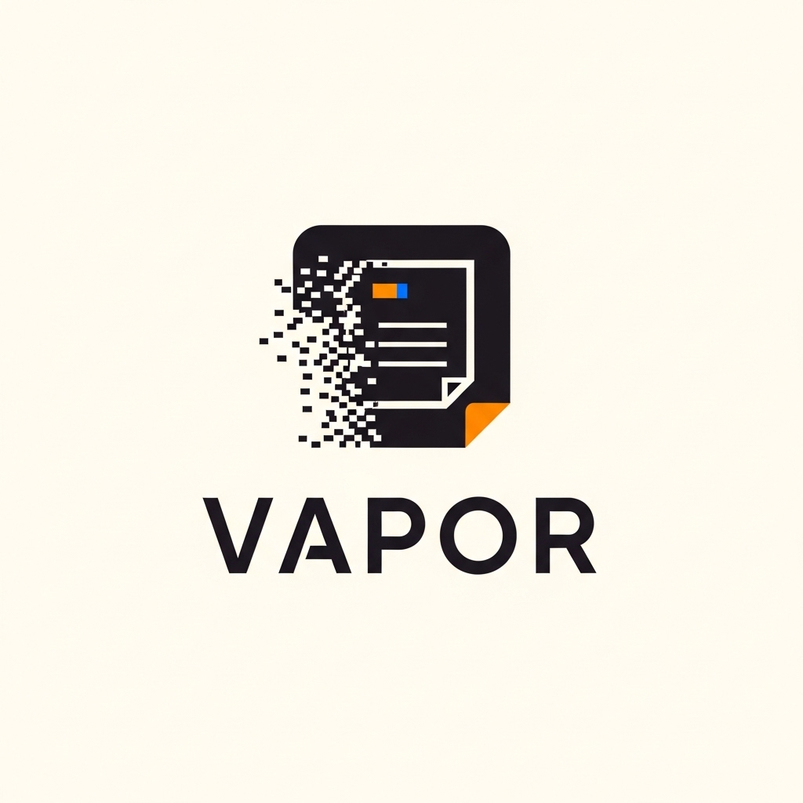

# VAPOR // NOTHING LASTS 
[](https://opensource.org/licenses/MIT)

<div align="center">
  
</div>

<p align="center">
  <strong>An anti-hoarding "read-it-later" application designed to combat digital clutter.</strong>
</p>

<p align="center">
  <a href="#overview">Overview</a> •
  <a href="#features">Features</a> •
  <a href="#tech-stack">Tech Stack</a> •
  <a href="#design-philosophy">Design Philosophy</a> •
  <a href="#getting-started">Getting Started</a> •
  <a href="#architecture">Architecture</a>
</p>

---

## Overview

We bookmark dozens of articles a week, telling ourselves we'll read them later. We rarely do. Unlimited storage creates infinite procrastination. 

**Vapor** forces consumption through a strict 7-day self-destruct mechanic. Every saved link is a ticking clock. You either read it, or you accept that it wasn't important enough to keep. 

## Features

- ⏱️ **7-Day Longevity**: Every saved item is permanently deleted exactly 168 hours after ingestion. No archives. No exceptions.
- 🧠 **AI-Powered Summarization**: Uses Ollama Cloud (GPT-OSS 120B) to automatically generate a concise thesis and 5 key bullet points for every article to accelerate consumption.
- 🧹 **Clean Extraction**: Leverages the Jina Reader API to strip ads, trackers, paywall popups, and visual clutter, leaving only pure Markdown content.
- 🔴 **Urgency Indicators**: A live-updating vertical feed featuring pulsing red urgency animations for items set to expire within 24 hours.
- 📊 **Digital Hygiene Tracking**: Profile management that tracks your ingestion vs. expiration stats, keeping you accountable for what you save.

## Tech Stack

Vapor is built for speed and reliability, utilizing a modern React ecosystem:

- **Framework**: [Next.js 16](https://nextjs.org/) (App Router, Server Components)
- **Styling**: [Tailwind CSS v4](https://tailwindcss.com/)
- **UI Architecture**: [shadcn/ui](https://ui.shadcn.com/) (Radix Mira style)
- **Database & Auth**: [Firebase](https://firebase.google.com/) (Firestore NoSQL, Google OAuth, Email/Password)
- **External APIs**: Jina Reader API (Scraping), Ollama Cloud API (LLM via official JS library)
- **Icons**: Lucide React & Hugeicons

## Design Philosophy

**"The Digital Forensic"**

Vapor rejects the softness of modern web design. The interface reflects the ephemeral, urgent nature of the content it holds:
- **Zero Border Radius**: Sharp 90-degree corners on every element. No friendly rounded edges.
- **High Contrast**: A brutalist palette of pure black (`#0e0e0e`) and raw white (`#e5e2e1`).
- **Terminal Typography**: Space Grotesk and JetBrains Mono ensure a raw, code-like readability.

## Getting Started

### Prerequisites
- Node.js (Latest LTS recommended)
- `pnpm` package manager
- Firebase Project (Auth + Firestore enabled)
- Ollama Cloud Account & API Key
- Jina Reader API Key

### Installation

1. **Clone the repository**:
   ```bash
   git clone [https://github.com/iamdainwi/vapor.git](https://github.com/iamdainwi/vapor.git)
   cd vapor

2. **Install dependencies**:
   ```bash
   pnpm install
   ```

3. **Environment Setup**:
   Create a `.env.local` file in the root directory and add the following variables:
   ```env
   # Firebase Client
   NEXT_PUBLIC_FIREBASE_API_KEY=your_api_key
   NEXT_PUBLIC_FIREBASE_AUTH_DOMAIN=your_auth_domain
   NEXT_PUBLIC_FIREBASE_PROJECT_ID=your_project_id
   NEXT_PUBLIC_FIREBASE_STORAGE_BUCKET=your_storage_bucket
   NEXT_PUBLIC_FIREBASE_MESSAGING_SENDER_ID=your_messaging_sender_id
   NEXT_PUBLIC_FIREBASE_APP_ID=your_app_id

   # Firebase Admin (Private)
   FIREBASE_SERVICE_ACCOUNT_KEY='{"type": "service_account", ...}'

   # AI APIs
   OLLAMA_API_KEY=your_ollama_key
   OLLAMA_URL=[https://ollama.com](https://ollama.com)

   # Security
   CLEANUP_API_SECRET=your_secure_cron_secret
   ```

4. **Run the development server**:
   ```bash
   pnpm dev
   ```